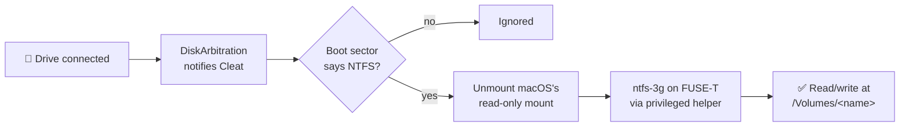

<div align="center">

# ⚓ Cleat

**Read/write NTFS drives on your Mac — from the menu bar, with no kernel extension.**

[](https://github.com/suraj-shetty/Cleat/actions/workflows/ci.yml)


[](LICENSE)

</div>

---

macOS reads NTFS, but it won't write to it. Plug in a Windows-formatted drive and every
copy, rename, and delete is refused.

Cleat fixes that. It sits in your menu bar, notices NTFS drives the moment they connect,
and remounts them read/write in one click — **without a kernel extension, without
disabling SIP, and without ever touching Startup Security Utility.**

## Highlights

| | |
|---|---|
| 🧩 **No kext, no security downgrade** | Built on [FUSE-T](https://www.fuse-t.org), a userspace FUSE. Nothing to approve in Recovery, nothing to reboot. |
| ⚡ **One click, or zero** | Mount read/write from the menu, or mark a drive *Always mount read/write* and Cleat handles it on connect. |
| 🗂️ **Native on macOS 26** | Uses FUSE-T's FSKit backend on Tahoe for proper Finder integration; falls back to NFS automatically. |
| 🛡️ **Never forces anything** | Busy volumes are reported, not force-unmounted. No formatting, erasing, or partitioning code exists. |
| 🔍 **Catches the classic trap** | Detects an `ntfs-3g` linked to macFUSE — which looks fine until mount time — and tells you exactly how to fix it. |
| 🔐 **Least privilege** | The UI runs as you. Only a small, code-signing-pinned helper touches raw disk devices. |

## How it works



1. **Detect** — DiskArbitration reports the new disk.
2. **Verify** — the helper reads the boot sector and only proceeds if it genuinely is NTFS.
3. **Release** — the read-only mount macOS created is unmounted, since `ntfs-3g` can't open a claimed device.
4. **Mount** — `ntfs-3g` attaches through FUSE-T: the **FSKit** backend on macOS 26, **NFSv4 loopback** on macOS 15.

> **Why not macFUSE?** It's a kernel extension. On Apple Silicon, approving one means
> booting into Reduced Security. Cleat is designed so you never have to.

## Getting started

### 1. Install the two dependencies

Cleat relies on **FUSE-T** and an **ntfs-3g built against FUSE-T**. One script sets up both:

```bash
Scripts/setup-dependencies.sh
```

It shows everything it will change before changing it, asks once, and prints the undo
commands at the end. It never touches kernel extensions, SIP, signing identities, or disks.

<details>
<summary><b>Prefer to do it by hand?</b></summary>

```bash
# 1. FUSE-T
sudo mkdir -p /usr/local/include
brew install macos-fuse-t/homebrew-cask/fuse-t

# 2. macOS 26 only (optional): open /Applications/fuse-t.app once, then enable it under
#    System Settings › General › Login Items & Extensions › File System Extensions.
#    Without this Cleat uses the NFS backend, which also works.

# 3. ntfs-3g, built against FUSE-T
brew install autoconf automake libtool pkg-config libgcrypt
git clone https://github.com/macos-fuse-t/ntfs-3g && cd ntfs-3g
export CPPFLAGS="-I/usr/local/include/fuse"
export LDFLAGS="-L/usr/local/lib -lfuse-t -Wl,-rpath,/usr/local/lib"
export ACLOCAL_PATH="$(brew --prefix)/share/aclocal:$ACLOCAL_PATH"
./autogen.sh
./configure --prefix=/usr/local --exec-prefix=/usr/local \
            --with-fuse=external --sbindir=/usr/local/bin --bindir=/usr/local/bin
make -j"$(sysctl -n hw.ncpu)"
sudo make install

# 4. The check that matters — must show libfuse-t, not libfuse.2
otool -L /usr/local/bin/ntfs-3g | grep fuse
```

`libgcrypt` is needed at build time even though crypto support is off, because
`configure.ac` expands `AM_PATH_LIBGCRYPT` during autoreconf regardless.

</details>

> ⚠️ **Don't use `brew install ntfs-3g-mac`.** It links against macFUSE, looks correct to
> `which ntfs-3g`, and fails only when you try to mount. Cleat detects this and refuses to use it.

### 2. Install Cleat

Download the notarized DMG from [**Releases**](https://github.com/suraj-shetty/Cleat/releases),
drag Cleat to Applications, and launch it. Or [build from source](#building-from-source).

### 3. Finish setup

Open **Setup…** from the menu bar icon. It checks every requirement, shows copyable fix-up
commands for anything missing, and walks you through two one-time approvals:

- **Install Helper** — approve Cleat in *System Settings › Login Items & Extensions*.
- **Full Disk Access** — add Cleat under *Privacy & Security*, then relaunch it.

When every row is green, plug in a drive and choose **Mount Read/Write**.

## Using Cleat

| Action | What it does |
|---|---|
| **Mount Read/Write** | Swaps macOS's read-only mount for a writable one. |
| **Always mount read/write** | Remembers the drive and mounts it writable whenever it connects. |
| **Open** | Reveals the mounted volume in Finder. |
| **Unmount (don't eject)** | Releases the volume but leaves the disk attached. |
| **Eject** | Unmounts and ejects, ready to unplug. |
| **Settings…** | Launch at login, confirm-before-auto-mount, and forget remembered drives. |

The menu bar icon shows a checkmark when any drive is mounted read/write, and a warning
badge when setup is incomplete.

## Safety model

Your data is on the other end of every code path, so the rules are strict:

- **Nothing is forced.** Unmounts never use `MNT_FORCE` or `kDADiskUnmountOptionForce`. A busy volume is reported as in use — never worked around.
- **Nothing is killed.** If `ntfs-3g` lingers after unmount, you get its PID, not a silent `SIGKILL`.
- **Nothing is formatted.** There is no code path that erases or repartitions a disk.
- **Devices are verified first.** `ntfs-3g` is only pointed at a device whose boot sector reads `NTFS`.
- **No shell, anywhere.** Every binary runs by absolute path with a real `argv`. A volume named `Evil,backend=nfs;rm -rf /` becomes one inert `volname=` value.
- **The root helper unmounts only what it mounted.** Mount points must sit strictly inside `/Volumes` and match the helper's own records.
- **Both processes pin each other's code signature** over XPC, so nothing else can drive the helper.

## Architecture

```
Cleat.app
├── Contents/MacOS/Cleat               SwiftUI menu-bar app (runs as you)
├── Contents/MacOS/CleatHelper         privileged launchd daemon (runs as root)
└── Contents/Library/LaunchDaemons/
    └── com.cleat.helper.plist         registered via SMAppService
```

Opening `/dev/diskNsM` for writing requires root, so rather than running the whole UI
privileged, all disk work lives in a small daemon registered with
`SMAppService.daemon(plistName:)` — no `SMJobBless`, and no files installed outside the app bundle.

<details>
<summary><b>Key source files</b></summary>

| File | Role |
|---|---|
| `Shared/HelperProtocol.swift` | XPC surface, request/response types, `BSDName` validation |
| `Shared/NTFS3GInvocation.swift` | Builds and re-parses ntfs-3g argument vectors |
| `Shared/DiskArbitrationBridge.swift` | Synchronous unmount/eject with typed errors |
| `Shared/MountTable.swift` | `getmntinfo` + `KERN_PROCARGS2` process inspection |
| `Shared/NTFSProbe.swift` | Boot-sector NTFS check |
| `Shared/XPCRequirement.swift` | Code-signing requirement construction and validation |
| `CleatHelper/MountEngine.swift` | The privileged mount / unmount / eject flow |
| `Cleat/Services/DiskMonitor.swift` | DiskArbitration callbacks |
| `Cleat/Services/DependencyChecker.swift` | FUSE-T, ntfs-3g, FSKit, Full Disk Access, and helper status |
| `Cleat/Services/AppModel.swift` | Reconciles hardware state with helper state |

</details>

<details>
<summary><b>Platform quirks Cleat handles</b></summary>

- **NFS-backend mounts don't appear in the Finder sidebar.** They're browsable at `/Volumes/<name>`; such rows are tagged `NFS` and **Open** reveals them in Finder.
- **DiskArbitration doesn't link a FUSE mount to its block device.** Cleat reads the mapping from the `ntfs-3g` process's argument vector, with a root-owned state file as fallback when launchd restarts the helper.
- **NTFS volumes often lack a `DAVolumeUUID`.** Preferences fall back to volume name + capacity, computable without root or mounting.
- **Busy FSKit volumes report `0xC010`, not `kDAReturnBusy`.** macOS 26 encodes POSIX errors as `0xC000 | errno`; both encodings are decoded.
- **macOS stacks mounts on the same path.** A mount left by a crash could be silently mounted over, so Cleat picks a suffixed mount point instead.
- **Other NTFS drivers can claim the disk first.** Setup names any found in `/Library/Filesystems`, and the mount flow releases whatever holds the device.

</details>

## Building from source

Requires **Xcode 26**, **Swift 6**, and [XcodeGen](https://github.com/yonaskolb/XcodeGen).

```bash
xcodegen generate
xcodebuild -project Cleat.xcodeproj -scheme Cleat -configuration Debug build
```

`Cleat.xcodeproj` is generated from `project.yml` and isn't committed.

Local builds sign ad hoc and work offline. For a distributable build, set your Team ID in
`Config/Signing.xcconfig` and `Shared/BuildConfiguration.swift`, then:

```bash
DEVELOPMENT_TEAM=XXXXXXXXXX \
SIGN_IDENTITY="Developer ID Application: … (XXXXXXXXXX)" \
NOTARY_PROFILE=my-notary-profile \
  Scripts/build-dmg.sh
```

The script contains no credentials and creates no signing identity.

## CI/CD

| Workflow | Trigger | What it does |
|---|---|---|
| [`ci.yml`](.github/workflows/ci.yml) | Push to `main`, pull requests | Generates the project, builds unsigned, and runs the no-volume QA harnesses — no secrets on the PR path. |
| [`release.yml`](.github/workflows/release.yml) | Pushing a `v*` tag | Builds, signs, notarizes, and staples the DMG, then publishes a GitHub Release. |

```bash
git tag -a v1.0.0 -m "Cleat 1.0.0" && git push origin v1.0.0
```

Secrets setup and the full pipeline design are in [`docs/CI-CD.md`](docs/CI-CD.md).

## Testing

**138 automated checks**, plus a root-required end-to-end mount test:

```bash
Tests/QA/run.sh                  # 47 guard + sanitizer checks, no drive needed
Tests/QA/run.sh disk23s1         # all 138 — ⚠️ unmounts the given volume
sudo Scripts/qa-mount-test.sh    # full read/write cycle on a volume labelled "QA Test NTFS"
```

Run volume-backed tests against a **throwaway disk image**, never a drive holding real data.

<details>
<summary><b>What has been verified</b></summary>

Verified on macOS 26.3, Apple Silicon, Xcode 26.6, FUSE-T 1.2.7, and `ntfs-3g 2022.10.3`
built from `macos-fuse-t/ntfs-3g` against `libfuse-t` (confirmed with both `otool -L` and
`DYLD_PRINT_LIBRARIES`).

- **Read/write mount end to end** — create, read back, append, rename, nested `mkdir`, a 100 MB write, and unicode/space/quote filenames all correct. Clean unmount with `ntfs-3g` exiting on its own; `ntfsfix -n` afterwards reported the volume clean.
- **Injection safety** — a hostile label is passed to a real spawned process and read back from the kernel via `KERN_PROCARGS2`: nine options in, nine out, nothing overridden.
- **Path traversal** — 14 hostile labels (`../../etc`, `/etc/passwd`, NUL bytes, 400 characters) all resolve directly under `/Volumes`.
- **Busy detection** — refused while a descriptor was open, succeeded once released, including the macOS 26 `0xC010` path.
- **Stability** — five mount/unmount cycles and three device attach/detach cycles with no crash reports.
- **Swift 6 strict concurrency** — both configurations build with zero warnings.

**Not yet verified:** eject-after-mount on real removable hardware (the test rig is a disk
image, which ejects through a different path).

</details>

## Performance

Throughput is bounded by the drive and its USB bridge, not by Cleat. A WD My Passport on
USB 3 measured **57–60 MB/s** buffered writes through the mount — the limit of the drive
and its bridge, not the driver.

## Requirements

- Apple Silicon Mac running **macOS 15 Sequoia** or **macOS 26 Tahoe**
- **FUSE-T** 1.1.0 or later
- **ntfs-3g** built against FUSE-T

## License

Cleat is released under the [MIT License](LICENSE).

Cleat doesn't bundle or link its dependencies — it launches them as separate programs.
**ntfs-3g** is licensed under the GNU GPL, and **FUSE-T** under its own terms; each is
installed separately by you.

## Acknowledgements

- [**FUSE-T**](https://github.com/macos-fuse-t/fuse-t) — kext-less FUSE for macOS
- [**ntfs-3g**](https://github.com/tuxera/ntfs-3g), via the [FUSE-T port](https://github.com/macos-fuse-t/ntfs-3g) — the NTFS read/write engine
